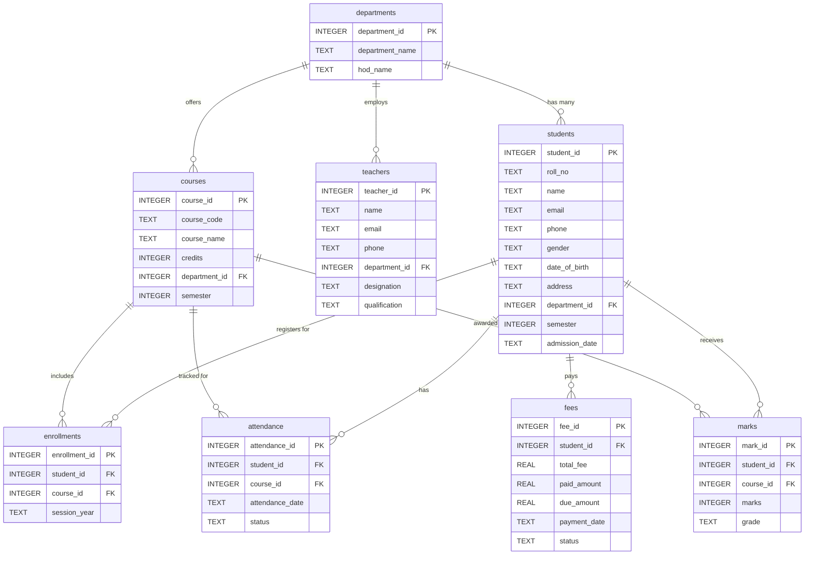

# CollegeHub Database ER Diagram

This document contains the Entity-Relationship (ER) diagram for the College Management System database. You can view this diagram visually by viewing this file in a Markdown previewer that supports Mermaid (like VS Code or GitHub).

